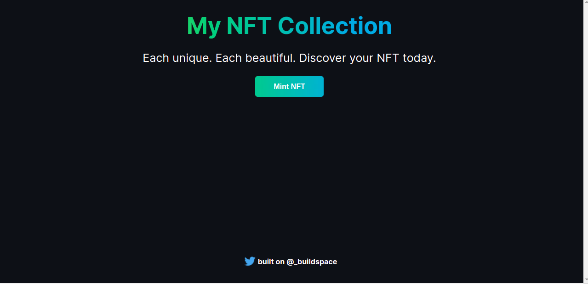

# Basic Dapp to mint NFTs
- Connect your wallet to mint a black box NFT containing 3 random words.
- A pop up shows the address of your minted NFT on Opensea.
- P.S. I built this Dapp following Buildspace tutorial.
  

## Address on Rinkeby Etherscan:
0xD9708Bb28FEf0b06C222cc59C7A7855AA180BD8c

## Link on Repl.It:
https://nft-starter-project.mennaabuelnaga.repl.co/
